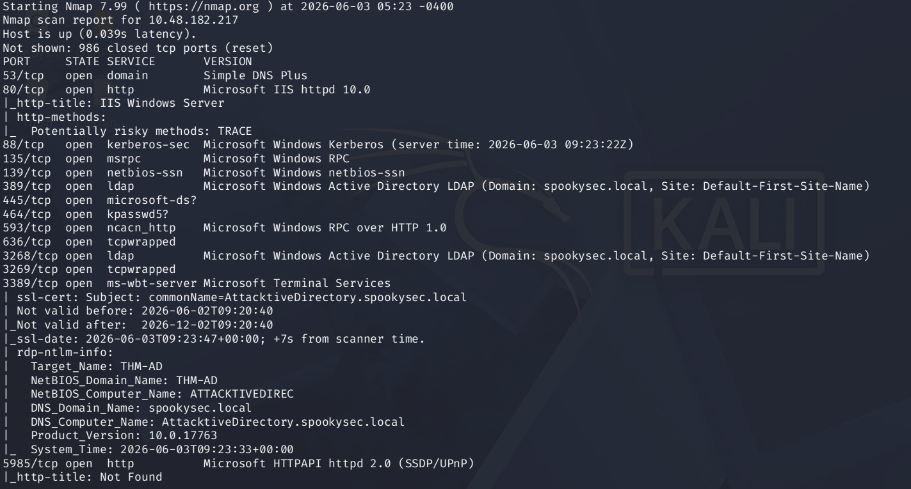

# Attacktive-Directory-THM
TryHackMe Attacktive Directory room write-up and notes

## Overview

Attacktive Directory is an Active Directory focused TryHackMe room that introduces enumeration, Kerberos attacks, and domain resource access.

## Attack Path

1. Service Enumeration
2. SMB Enumeration
3. Username Discovery
4. Kerberos Enumeration
5. AS-REP Roasting
6. Password Cracking
7. Domain Resource Access

---
## Step 1 - Service Enumeration

### Objective

Identify exposed services and determine whether the target is an Active Directory Domain Controller.

### Command

```bash
nmap -sC -sV <target-ip>
```

### Findings

Observed services:

- Kerberos (88)
- LDAP (389)
- SMB (445)
- DNS (53)

These services strongly indicated an Active Directory environment.

### Screenshot


